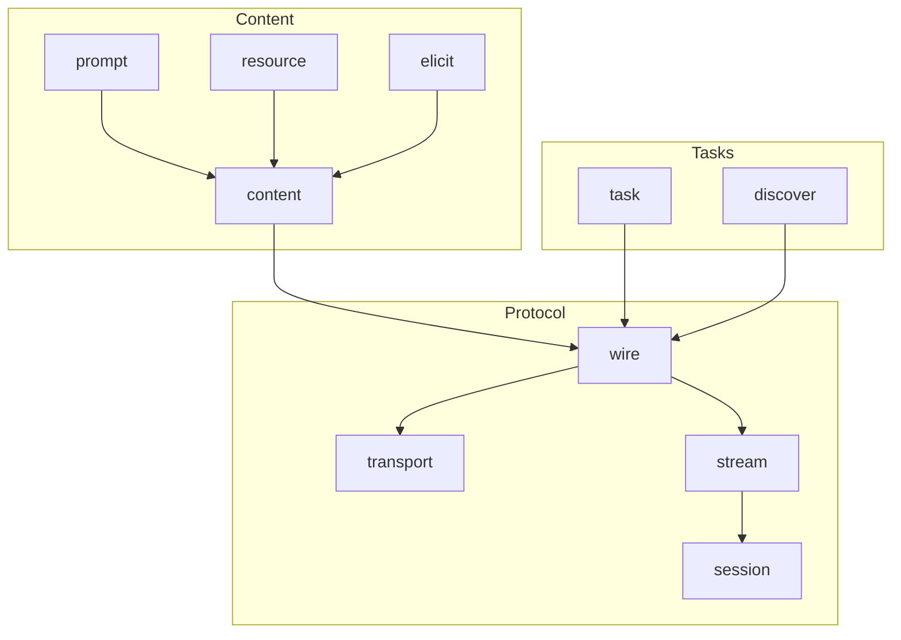

# toolprotocol Architecture

The toolprotocol layer defines protocol primitives for tool exchange. It does
not implement execution or discovery; it standardizes **how** tools, results,
and streams are transported between systems.

## Design Principles

- **Protocol-first**: wire/transport types are independent of transport runtime.
- **Composable**: packages can be used individually (e.g., `wire` only).
- **Deterministic**: message schemas are stable and versioned.
- **Streaming-safe**: stream/session types are concurrency-safe by default.

## Core Packages

| Package | Responsibility |
|---------|----------------|
| `wire` | Low-level protocol types and envelopes |
| `transport` | Transport-agnostic interfaces (SSE/stdio/etc.) |
| `content` | Content blocks and rendering helpers |
| `stream` | Streaming event types and default stream implementation |
| `session` | Session identifiers, lifecycles, and context |
| `task` | Task/event primitives for long-running work |
| `resource` | Resource references and metadata |
| `prompt` | Prompt templates and variables |
| `discover` | Discovery request/response types |
| `elicit` | Elicitation prompts and responses |

## Layering

## Protocol Boundary

`toolprotocol` is consumed by higher layers (e.g., `metatools-mcp`). It does not
own transport servers/clients itself. The intention is to keep protocol types
portable across SSE, stdio, and HTTP.

## Concurrency Contract

- Streams must be safe for concurrent writers and readers.
- Close operations are idempotent.
- Sessions must not leak goroutines or block on close.

## Consolidation Note

Legacy protocol primitives from the pre-consolidation stack are now unified
here, with stable import paths under `github.com/jonwraymond/toolprotocol/...`.
